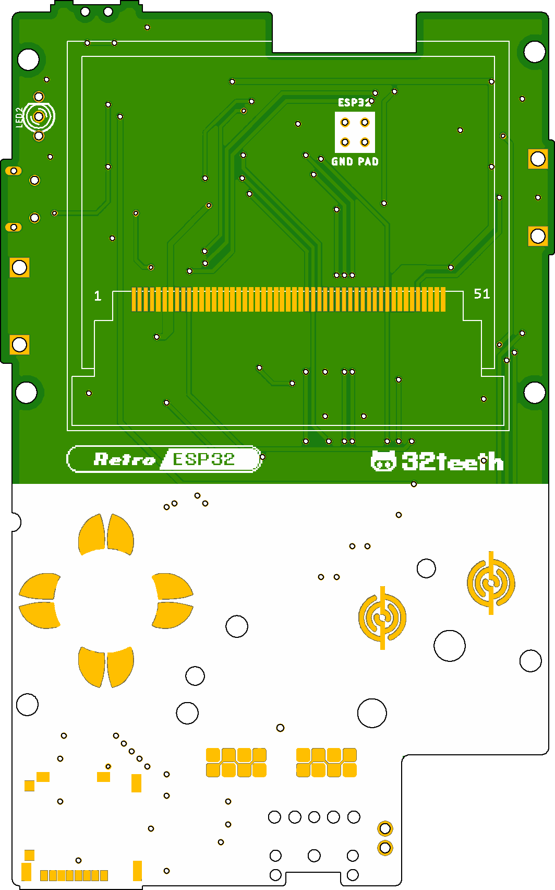
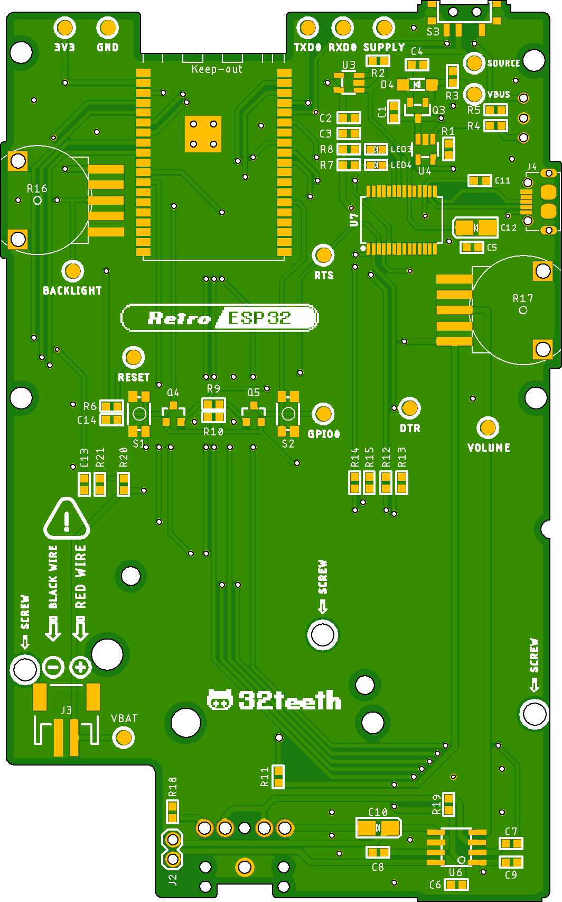

# 
> An ESP32 Wrover based Game Boy Pocket ** Hardware Branch **

[![Downloads](https://img.shields.io/github/downloads/retro-esp32/RetroESP32/total?style=for-the-badge&color=hotpink&logo=data:image/gif;base64,R0lGODlhYgB3AKIFAMwAAN9fX/THx88PD////////wAAAAAAACH/C1hNUCBEYXRhWE1QPD94cGFja2V0IGJlZ2luPSLvu78iIGlkPSJXNU0wTXBDZWhpSHpyZVN6TlRjemtjOWQiPz4gPHg6eG1wbWV0YSB4bWxuczp4PSJhZG9iZTpuczptZXRhLyIgeDp4bXB0az0iQWRvYmUgWE1QIENvcmUgNS42LWMxMzggNzkuMTU5ODI0LCAyMDE2LzA5LzE0LTAxOjA5OjAxICAgICAgICAiPiA8cmRmOlJERiB4bWxuczpyZGY9Imh0dHA6Ly93d3cudzMub3JnLzE5OTkvMDIvMjItcmRmLXN5bnRheC1ucyMiPiA8cmRmOkRlc2NyaXB0aW9uIHJkZjphYm91dD0iIiB4bWxuczp4bXA9Imh0dHA6Ly9ucy5hZG9iZS5jb20veGFwLzEuMC8iIHhtbG5zOnhtcE1NPSJodHRwOi8vbnMuYWRvYmUuY29tL3hhcC8xLjAvbW0vIiB4bWxuczpzdFJlZj0iaHR0cDovL25zLmFkb2JlLmNvbS94YXAvMS4wL3NUeXBlL1Jlc291cmNlUmVmIyIgeG1wOkNyZWF0b3JUb29sPSJBZG9iZSBQaG90b3Nob3AgQ0MgMjAxNyAoTWFjaW50b3NoKSIgeG1wTU06SW5zdGFuY2VJRD0ieG1wLmlpZDpCOUQzNzMwM0RENzcxMUU5ODg0M0IzRDNEM0E3MUNENSIgeG1wTU06RG9jdW1lbnRJRD0ieG1wLmRpZDpCOUQzNzMwNERENzcxMUU5ODg0M0IzRDNEM0E3MUNENSI+IDx4bXBNTTpEZXJpdmVkRnJvbSBzdFJlZjppbnN0YW5jZUlEPSJ4bXAuaWlkOkI5RDM3MzAxREQ3NzExRTk4ODQzQjNEM0QzQTcxQ0Q1IiBzdFJlZjpkb2N1bWVudElEPSJ4bXAuZGlkOkI5RDM3MzAyREQ3NzExRTk4ODQzQjNEM0QzQTcxQ0Q1Ii8+IDwvcmRmOkRlc2NyaXB0aW9uPiA8L3JkZjpSREY+IDwveDp4bXBtZXRhPiA8P3hwYWNrZXQgZW5kPSJyIj8+Af/+/fz7+vn49/b19PPy8fDv7u3s6+rp6Ofm5eTj4uHg397d3Nva2djX1tXU09LR0M/OzczLysnIx8bFxMPCwcC/vr28u7q5uLe2tbSzsrGwr66trKuqqainpqWko6KhoJ+enZybmpmYl5aVlJOSkZCPjo2Mi4qJiIeGhYSDgoGAf359fHt6eXh3dnV0c3JxcG9ubWxramloZ2ZlZGNiYWBfXl1cW1pZWFdWVVRTUlFQT05NTEtKSUhHRkVEQ0JBQD8+PTw7Ojk4NzY1NDMyMTAvLi0sKyopKCcmJSQjIiEgHx4dHBsaGRgXFhUUExIREA8ODQwLCgkIBwYFBAMCAQAAIfkEAQAABQAsAAAAAGIAdwAAA/9YtNz+MMpJq3Xq6s27/2AojmRpnmiqrmzrvnAsz7Ra3Hiu73zv/z0XcEgsEoXGpLKIXDqfuSZ0qpRSr0MrdsvTcr83L5grHmPLZio6DV2zne53tSX/xutMOv4MEgQGAQIRe3wfAQCIAYOEaiADiAADi4xtIIeJk5RwfX+BmZpzLKBPd6M6paY4qKkZoqxGq6mxprOjtaC3mrmUu4y9hL97wXjDdcVyx2/JbMtpzWbPY9Fg03Z6r0fX2EDVZNrbPt1b4oUr4Fnf5zvkV+yNrupBGq019RL09vkMYfr9C/z+8qkKaC8KwXoGD8pYpzBGl4ZoIJqLR7GixYsYM2rcyLGoo8ePIL3tC1npXrsJ2yycNMlq3hQKrzi8RCmrQ8lPumySoklL5yaWuD7sBJrTw1CcvoT+RApMqbwT5Qg8NBoOxUyiVKtCPQo061MTXHl6nQp2iUyAF9BtTZLVJTeroTYk5Pl2LSyfaCHctZttbF6zcPfiHRc4j19ldK8ORpb45llhjR2nTUpUsVvIlSWrpMw0LExekS2HZpz53WjSnUVjIMmVtevXSRIAADs=)](https://github.com/retro-esp32/RetroESP32/releases/latest)

## Hardware
> FTDI Solution

Thanks to a recent contribution, we will be testing out the replacement of the CP2104 USB to UART bridge IC with an FTDI FT232RL IC

The FTDI IC is more hand solder friendly than the CP210x QFN series

Here is a teaser of what we are testing

| Top Layout | Bottom Layout |
| ------------------ | ---------------- |
|  |  |

## Gerbers
> You can use the Gerber Files to check your production

*note:* PCB thickness must be 1mm

## BOM
> Full Bom Available

*note:* LCD and Thumbwheels have AliExpress Links

### Eagle Library
> We use a Managed Library

[RetroESP32](urn:adsk.eagle:library:12566846)

-----

> ## Although we do this for 💕 of 🕹️
> **We Also Like Coffee!**
> *Please Consider Supporting* 
> 

-----